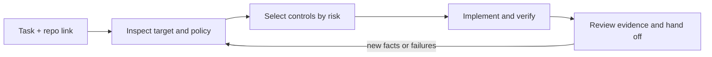

# exec-ctrl v2

**Development discipline for agents, activated with a repository link.**

Give your agent the work and this repository:

> Fix the checkout retry bug. Use https://github.com/LeiterConsulting/exec-ctrl/tree/v2

The `v2` branch contains this preview. The default branch retains v1. Use the
branch-specific link above when evaluating v2, or pin it to a reviewed commit.

The agent reads the entry instructions, inspects your project, selects relevant
controls, and carries them through implementation, verification and handoff.
You do not need to pick modules, install a plugin, or create a document pack.

## Agents: start here

**Read [START_HERE.md](START_HERE.md) and follow its activation sequence.**
Treat this repository as the method source and the user's workspace as the
target, unless the request explicitly asks to improve exec-ctrl itself. Retrieve
linked files from the same revision. If the host cannot fetch repository content,
report that limit; do not claim the framework was loaded.

## What changes in v2

- **Proportionate control:** a small fix needs a short record; complex work gets
  explicit dependencies, risk, owners and release gates.
- **Selective guidance:** load relevant modules for policy, Git, security,
  functional correctness, troubleshooting, architecture, documentation, delivery,
  team systems and enterprise rules.
- **Evidence before completion:** connect requirements to implementation and
  verification; distinguish source inspection, tests, deployment and live results.
- **Fits existing teams:** reuse their instructions, issues, reviews and CI.
  Record policy sources and unresolved conflicts instead of inventing rules.
- **Portable activation:** plain Markdown works with any agent that can retrieve
  and follow it. Optional local adapters support future sessions.
- **Checkable records:** an optional Python helper routes declared task facts,
  adds enterprise gates and checks evidence-record structure without network access.

## Explore

| Need | Entry |
| --- | --- |
| Use exec-ctrl now | [Activation contract](START_HERE.md) |
| Understand the rules | [Operating model](docs/v2/OPERATING_MODEL.md) |
| Configure an IDE | [Adapters and retrieval](docs/v2/ADAPTERS.md) |
| Apply company policy | [Enterprise rules](modules/enterprise.md) |
| Use optional local checks | [Tooling](docs/v2/TOOLING.md) |
| See task walkthroughs | [Examples](examples/v2/README.md) |
| Upgrade an existing adoption | [Migration](docs/v2/MIGRATION.md) |
| Assess readiness and next work | [Review and roadmap](docs/v2/ROADMAP.md) |
| Maintain the framework | [Contributing](CONTRIBUTING.md) |

## Status

**2.0.0-preview.2** includes fixes from adversarial testing of policy-record
resumption, Markdown links and JSON input handling. The Markdown workflow and
offline helper are usable for evaluation. Cross-agent field acceptance and a
stable v2 release remain open; see the [validation record](docs/exec_ctrl/V2_FOUNDATION_AUDIT_LOG.md).

The first [controlled test project](docs/exec_ctrl/V2_CONTROLLED_LAB_RESULTS.md)
passed 50 lab checks, and hosted Windows/Linux CI passed. Independent blind
task-plus-link trials across IDEs remain pending.

The [second test pass](docs/exec_ctrl/V2_SECOND_PASS_TESTING.md) passed 73 framework
tests and 55 expanded lab checks, including 68 real HTTP checks. Windows/Linux CI
passed; these controlled results remain separate from independent field trials.

A URL cannot force an IDE to retrieve instructions. exec-ctrl also cannot enforce
permissions, branch protection or organizational policy by itself. Use the host's
controls and CI for enforcement; the framework makes the agent's obligations and
evidence explicit.

Existing v1 users can keep their workflows. The [v1 guide](V1_README.md), templates
and historical records remain available as versioned reference.
