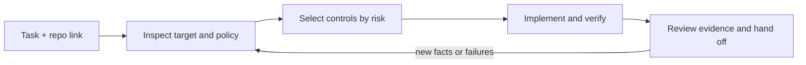

# exec-ctrl v2

**Development discipline for agents, activated with a repository link.**

Give your agent the work and this repository:

> Fix the checkout retry bug. Use https://github.com/LeiterConsulting/exec-ctrl

The default branch, `main`, carries the current v2 preview. See the
[preview 5 release](https://github.com/LeiterConsulting/exec-ctrl/releases/tag/v2.0.0-preview.5)
for changes and verification. For reproducible adoption, give your agent the
[version tag](https://github.com/LeiterConsulting/exec-ctrl/tree/v2.0.0-preview.5)
and retrieve all instructions from that revision. The older `v2` branch is historical;
use `main` for current updates. The preserved [v1 guide](V1_README.md) remains available.

The agent reads the entry instructions, inspects your project, selects relevant
controls, and carries them through implementation, verification and handoff.
You do not need to pick modules, install a plugin, or create a document pack.

## Agents: start here

**Read [START_HERE.md](START_HERE.md) and follow its activation sequence.**
Treat this repository as the method source and the user's workspace as the
target, unless the request explicitly asks to improve exec-ctrl itself. Retrieve
linked files from the same revision. If the host cannot fetch repository content,
report that limit; do not claim the framework was loaded.

## What changes in v2

- **Proportionate control:** a small fix needs a short record; complex work gets
  explicit dependencies, risk, owners and release gates.
- **Selective guidance:** load relevant modules for policy, Git, security,
  functional correctness, troubleshooting, architecture, documentation, delivery,
  team systems and enterprise rules.
- **Evidence before completion:** connect requirements to implementation and
  verification; distinguish source inspection, tests, deployment and live results.
- **Fits existing teams:** reuse their instructions, issues, reviews and CI.
  Record policy sources and unresolved conflicts instead of inventing rules.
- **Portable activation:** plain Markdown works with any agent that can retrieve
  and follow it. Optional local adapters support future sessions.
- **Checkable records:** an optional Python helper routes declared task facts,
  generates pending records, adds enterprise gates and checks evidence-record
  structure without network access.
- **Current-input evidence:** explicit-file snapshots detect changed inputs before
  closure; required evidence kinds distinguish build, deployment and live stages.
- **Session continuity:** checkpoints preserve scope, decisions, failed hypotheses
  and the next action across interrupted work and changing context.

```mermaid
flowchart LR
  A[Task + repo link] --> B[Inspect target and policy]
  B --> C[Select controls by risk]
  C --> D[Implement and verify]
  D --> E[Review evidence and hand off]
  E -->|new facts or failures| B
```

## Explore

| Need | Entry |
| --- | --- |
| Use exec-ctrl now | [Activation contract](START_HERE.md) |
| Understand the rules | [Operating model](docs/v2/OPERATING_MODEL.md) |
| Apply controls to daily work | [Task playbooks](docs/v2/PLAYBOOKS.md) |
| Resume or manage a long session | [Session loop](docs/v2/SESSION_LOOP.md) |
| Configure an IDE | [Adapters and retrieval](docs/v2/ADAPTERS.md) |
| Apply company policy | [Enterprise rules](modules/enterprise.md) |
| Fit existing issue/PR systems | [Integration mappings](docs/v2/INTEGRATIONS.md) |
| Use optional local checks | [Tooling](docs/v2/TOOLING.md) |
| See task walkthroughs | [Examples](examples/v2/README.md) |
| Upgrade an existing adoption | [Migration](docs/v2/MIGRATION.md) |
| Assess readiness and next work | [Review and roadmap](docs/v2/ROADMAP.md) |
| Track version changes | [Changelog](CHANGELOG.md) |
| Maintain the framework | [Contributing](CONTRIBUTING.md) |

## Status

**2.0.0-preview.5** brings the controlled real-project feedback and disposable
release/rollback acceptance into a versioned public preview. It checks artifact
identity despite a healthy response, preserves required review holds, and rejects
stale README/changelog versions during repository validation. It retains the compact
activation entry, session controls, typed policy gates and offline, read-only helper.
See [preview 5 publication evidence](docs/exec_ctrl/V2_PREVIEW_5_PUBLICATION.md) and
[test coverage](tests/README.md) for current results and reproduction commands.

The [Ping Monitor revisit](docs/exec_ctrl/REAL_PROJECT_PING_MONITOR.md) exercised a
real Go defect in an isolated worktree. The
[policy/release scenarios](docs/exec_ctrl/V2_POLICY_RELEASE_ACCEPTANCE.md) exercised
actual disposable artifacts and deliberately held missing approval. These controlled
cases inform the guidance; they do not establish independent IDE adoption.

The [preview 3 evolution record](docs/exec_ctrl/V2_SESSION_EVOLUTION.md) preserves
its 97-test hosted validation and controlled lab results. Those historical results
are not proof of this revision.

Previous [controlled lab results](docs/exec_ctrl/V2_SECOND_PASS_TESTING.md) remain
versioned evidence. Independent task-plus-link trials across IDEs and the stable
v2 release gate remain open; see [field trials](docs/v2/FIELD_TRIALS.md).

A URL cannot force an IDE to retrieve instructions. exec-ctrl also cannot enforce
permissions, branch protection or organizational policy by itself. Use the host's
controls and CI for enforcement; the framework makes the agent's obligations and
evidence explicit.

Existing v1 users can keep their workflows. The [v1 guide](V1_README.md), templates
and historical records remain available as versioned reference.

## License

exec-ctrl is available under the [MIT license](LICENSE).
